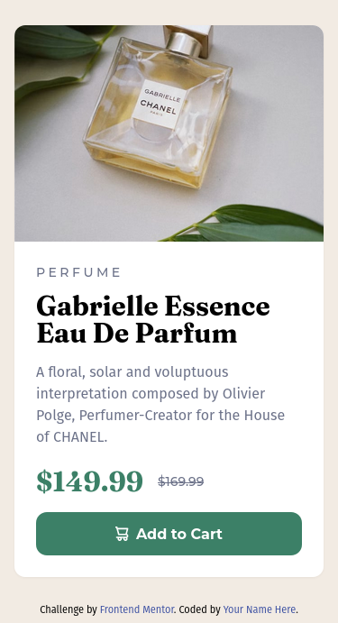
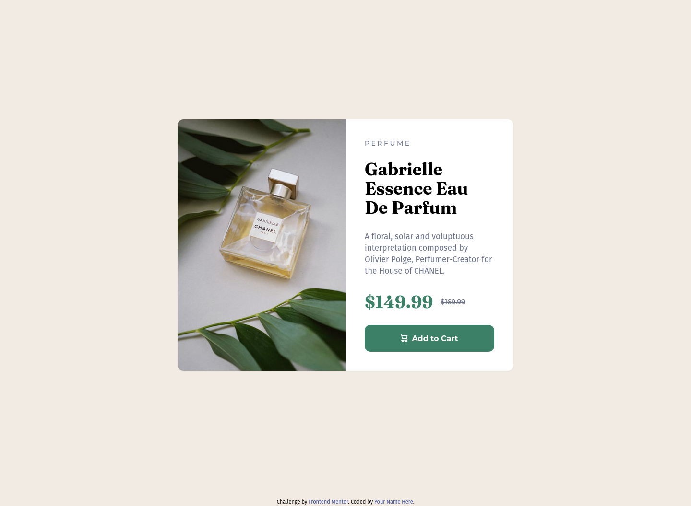

# Frontend Mentor - Product preview card component solution

This is a solution to the [Product preview card component challenge on Frontend Mentor](https://www.frontendmentor.io/challenges/product-preview-card-component-GO7UmttRfa). Frontend Mentor challenges help you improve your coding skills by building realistic projects.

## Table of contents

- [Overview](#overview)
  - [The challenge](#the-challenge)
  - [Screenshot](#screenshot)
  - [Links](#links)
- [My process](#my-process)
  - [Built with](#built-with)
  - [What I learned](#what-i-learned)
  - [Continued development](#continued-development)
  - [Useful resources](#useful-resources)
- [Author](#author)
- [Acknowledgments](#acknowledgments)

## Overview

### The challenge

Users should be able to:

- View the optimal layout depending on their device's screen size
- See hover and focus states for interactive elements

### Screenshot

#### Mobile View



#### Desktop View



### Links

- Solution URL: [Frontend Mentor](https://www.frontendmentor.io/solutions/mobile-first-solution-using-tailwind-css-breakpoints-6C0Xm1zJVt)
- Live Site URL: [Vercel](https://product-preview-card-component-lime.vercel.app/)

## My process

### Built with

- Semantic HTML5 markup
- Tailwind CSS
- Flexbox
- Mobile-first workflow

### What I learned

I learned more efficient ways to scale elements in html and to conditionally render an image according to the page size.

```html
<!-- mobile picture -->

<!-- desktop picture -->

```

### Continued development

I want to learn to work with interactivity and animations using Tailwind. I hope to have the opportunity to experiment with this in future projects!

### Useful resources

- [Tailwind documentation](https://www.tailwindcss.com) - Great documentation as always.

## Author

- GitHub - [Marlon Couto](https://www.github.com/devpatola)
- Frontend Mentor - [@devpatola](https://www.frontendmentor.io/profile/devpatola)

## Acknowledgments

I appreciate [Luana Mayumi's](https://www.github.com/LuanaMayumi) help and support in completing this project.
